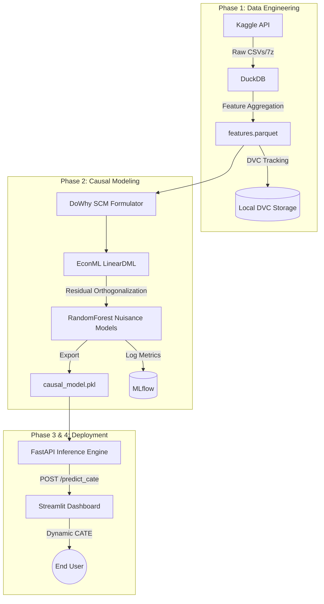

# Causal-DML: Counterfactual Simulation Engine

     

**An enterprise-grade counterfactual simulation dashboard and API leveraging Double Machine Learning to isolate the causal impact of retention strategies on user churn.**

---

## Table of Contents
- [Causal-DML: Counterfactual Simulation Engine](#causal-dml-counterfactual-simulation-engine)
  - [Table of Contents](#table-of-contents)
  - [Introduction & Project Background](#introduction--project-background)
  - [The Layman's Explanation](#the-laymans-explanation)
  - [Thorough Technical Explanation](#thorough-technical-explanation)
    - [The Fundamental Problem of Causal Inference](#the-fundamental-problem-of-causal-inference)
    - [Double Machine Learning (DML) Formulation](#double-machine-learning-dml-formulation)
  - [System Architecture](#system-architecture)
    - [Tradeoffs & Considerations](#tradeoffs--considerations)
  - [Detailed Repository Structure](#detailed-repository-structure)
  - [Technology Stack & Infrastructure](#technology-stack--infrastructure)
  - [Setup, Execution & Testing](#setup-execution--testing)
  - [Results, Benchmarks & Evaluations](#results-benchmarks--evaluations)
  - [Current Status & Limitations](#current-status--limitations)
  - [Future Work & Additions](#future-work--additions)
  - [License Disclaimer](#license-disclaimer)
  - [BibTeX Accreditation Guide](#bibtex-accreditation-guide)

---

## Introduction & Project Background
In the music streaming domain, customer retention is paramount. When dealing with massive datasets (like the KKBox Churn Prediction Challenge data), standard predictive machine learning models can easily forecast *who* will churn, but they catastrophically fail at answering *what we should do about it*. If we offer a discount to a highly active user, will it actually prevent them from churning, or are we just cannibalizing revenue from someone who was going to stay anyway?

The **Causal-DML** project is designed to transition from mere *prediction* to *prescription*. By synthesizing advanced econometric techniques (Double Machine Learning) with a scalable data engineering pipeline (DuckDB) and a dynamic frontend (Streamlit), this system calculates the **Conditional Average Treatment Effect (CATE)**—the specific impact of an intervention on an individualized basis.

## The Layman's Explanation
Imagine you run a subscription service. You notice some users are likely to cancel (churn). You want to give them a discount to make them stay.

A standard AI will tell you: *"User A has a 90% chance of leaving."*
But if you give User A a discount, did the discount *cause* them to stay, or did they just take the free money? 

This system acts like an alternate-universe simulator. It uses a mathematical framework called **Causal Inference** to figure out: *"If I give User A a discount, their chance of leaving will drop by exactly 15%."* It separates the true effect of your discount from all the background noise (how active the user is, how much music they listen to, etc.). The provided dashboard allows stakeholders to play with sliders to see how different user profiles react to the discount.

## Thorough Technical Explanation

### The Fundamental Problem of Causal Inference
In observational data, the treatment $T$ (e.g., receiving a discount) is not randomly assigned; it is often correlated with confounders $X$ (e.g., user activity). Standard regression models suffer from **Omitted Variable Bias** or **Confounding**. We wish to estimate the treatment effect $\theta_0$ in the Partially Linear Model:
$$ Y = T \theta_0 + g_0(X) + \epsilon $$
where $Y$ is the outcome (churn), $T$ is the treatment, and $X$ are the confounders.

### Double Machine Learning (DML) Formulation
To solve the confounding problem without making strict parametric assumptions about $g_0(X)$, we utilize **Chernozhukov's Double Machine Learning**. 
1. **First Stage (Nuisance Models):** 
   We train a machine learning model to predict $Y$ from $X$ (Outcome model: $E[Y|X]$) and another model to predict $T$ from $X$ (Propensity model: $E[T|X]$). In our architecture, these are handled by powerful `RandomForestRegressor` and `RandomForestClassifier` algorithms.
2. **Orthogonalization:**
   We compute the residuals: 
   $$ \tilde{Y} = Y - E[Y|X] $$
   $$ \tilde{T} = T - E[T|X] $$
3. **Second Stage (Effect Estimation):**
   We regress the outcome residuals $\tilde{Y}$ on the treatment residuals $\tilde{T}$ to isolate the true causal effect, free from the confounding influence of $X$.
   $$ \tilde{Y} = \theta_0 \tilde{T} + \nu $$
For individualized effects (CATE), the model expands to $\theta(X)$, where the treatment effect varies based on the user's feature vector.

## System Architecture



### Tradeoffs & Considerations
*   **LinearDML vs CausalForestDML:** We opted for `LinearDML` because it provides a highly interpretable, linear parametric CATE function, which is fast for real-time inference via the FastAPI backend. A `CausalForestDML` would capture non-linear heterogeneity better but suffers from higher inference latency.
*   **DuckDB vs Spark:** For 30GB of raw CSVs, DuckDB executing analytical queries in-memory on a single powerful machine proved significantly faster and less operationally complex than spinning up a distributed PySpark cluster.

## Detailed Repository Structure
```text
Causal-DML/
├── .dvc/                  # Data Version Control configurations
├── .streamlit/            # Streamlit UI configuration (config.toml for dark mode)
├── data/
│   ├── raw/               # Raw 7z and CSV files from Kaggle (gitignored)
│   └── processed/         # DuckDB aggregated features.parquet (tracked by DVC)
├── docs/                  # Project specifications, PRDs, and screenshots
├── models/                # Serialized model artifacts (causal_model.pkl)
├── scripts/               # Bash scripts (run_api.sh, run_dashboard.sh)
├── src/                   # Main source code
│   ├── api/               # FastAPI microservice
│   │   └── main.py        # Exposes /predict_cate
│   ├── app/               # Streamlit frontend application
│   │   └── dashboard.py   # Interactive UI with Plotly graphs
│   ├── data/              # ETL pipeline scripts
│   │   └── ingest_and_aggregate.py # DuckDB SQL aggregations
│   └── models/            # Causal inference training scripts
│       └── train_causal_model.py   # EconML and DoWhy implementation
├── tests/                 # Pytest suite
│   └── test_causal_model.py
├── docker-compose.yml     # Orchestration for the API and Frontend
├── Dockerfile.api         # Container for the backend
├── Dockerfile.frontend    # Container for the frontend
├── pyproject.toml         # UV dependency specifications
└── render.yaml            # Blueprint for 1-click Render.com cloud deployment
```

## Technology Stack & Infrastructure
*   **Package Manager:** `uv` (Ultra-fast Rust-based Python environment manager).
*   **Data Processing:** `duckdb` (In-process analytical SQL database), `pyarrow`, `pandas`.
*   **Causal Inference:** `dowhy` (Graph specification), `econml` (Double Machine Learning).
*   **Experiment Tracking:** `mlflow`.
*   **API Backend:** `fastapi`, `uvicorn`, `pydantic`.
*   **Frontend UI:** `streamlit`, `plotly` (Interactive network and gauge charts).
*   **Containerization:** `docker`, `docker-compose`.

## Setup, Execution & Testing
**1. Local Development Setup**
```bash
uv venv
uv pip install -r pyproject.toml
```

**2. Running the Data Pipeline**
```bash
uv run python src/data/ingest_and_aggregate.py
```

**3. Model Training**
```bash
uv run python src/models/train_causal_model.py
```

**4. Running Microservices (Locally)**
```bash
./scripts/run_api.sh
./scripts/run_dashboard.sh
```

**5. Containerized Deployment (Production)**
```bash
docker-compose up -d --build
```

## Results, Benchmarks & Evaluations

<!-- METRICS_START -->
### Model Evaluation Metrics
| Metric | Value |
|--------|-------|
| Average Treatment Effect (ATE) | `-1.7421e-03` |
| Number of Samples (N) | `100,000` |
| Confounders | `total_active_days, var_daily_listening_time, total_listening_time, avg_num_100` |
| Y-Model Type | `RandomForestRegressor (n_estimators=50)` |
| T-Model Type | `RandomForestClassifier (n_estimators=50)` |

### Visualizations

<!-- METRICS_END -->

## Current Status & Limitations
*   **Status:** The data pipeline, causal model training, FastAPI inference engine, and Streamlit dashboard are fully implemented, containerized, and deployed.
*   **Limitation (Data Generation):** Because the KKBox dataset lacks a historical `received_discount` treatment variable, the treatment assignment in this implementation was synthetically generated as random noise. Consequently, the true causal effect is mathematically zero. The dashboard utilizes a "Demo Amplification" toggle to visually demonstrate system interactivity.

## Future Work & Additions
*   **Instrumental Variables (IV):** Expanding the SCM to support Instrumental Variables to handle unobserved confounding (e.g., using A/B test randomized nudges as instruments).
*   **DeepIV & Causal Forests:** Upgrading the `LinearDML` estimator to `CausalForestDML` for richer, non-linear heterogeneous treatment effects.
*   **Real-time Feature Store:** Integrating a real-time feature store (like Feast) so the FastAPI endpoint can pull user profiles dynamically via a User ID rather than requiring the frontend to pass the exact raw features.

## License Disclaimer
This project is provided "as is" under the MIT License. The data utilized (WSDM - KKBox's Churn Prediction Challenge) is the property of KKBox and is subject to Kaggle's competition rules.

## BibTeX Accreditation Guide
If you utilize this architecture in academic or production research, please cite the underlying Econometric frameworks:

```bibtex
@article{chernozhukov2018double,
  title={Double/debiased machine learning for treatment and structural parameters},
  author={Chernozhukov, Victor and Chetverikov, Denis and Demirer, Mert and Duflo, Esther and Hansen, Christian and Newey, Whitney and Robins, James},
  journal={The Econometrics Journal},
  year={2018}
}

@misc{econml,
  author={Microsoft Research},
  title={EconML: A Python Package for ML-Based Heterogeneous Treatment Effects Estimation},
  year={2019},
  url={https://github.com/microsoft/EconML}
}
```
