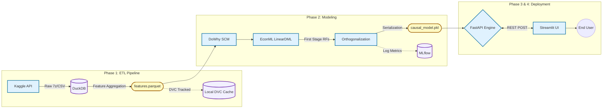
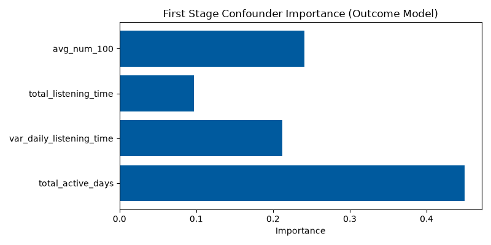

# Causal-DML: Counterfactual Simulation Engine

     

An enterprise-grade counterfactual simulation dashboard and REST API leveraging Double Machine Learning to isolate the causal impact of retention strategies on user churn.

---

## Table of Contents
- [Introduction](#introduction)
- [Executive Summary](#executive-summary)
- [Causal Inference Framework \& Methodology](#causal-inference-framework--methodology)
  - [The Fundamental Problem of Causal Inference](#the-fundamental-problem-of-causal-inference)
  - [Double Machine Learning (DML) Formulation](#double-machine-learning-dml-formulation)
- [System Architecture](#system-architecture)
  - [Tradeoffs \& Considerations](#tradeoffs--considerations)
- [Repository Structure](#repository-structure)
- [Technology Stack \& Infrastructure](#technology-stack--infrastructure)
- [Setup, Execution \& Testing](#setup-execution--testing)
- [Results, Benchmarks \& Evaluations](#results-benchmarks--evaluations)
- [Current Status \& Limitations](#current-status--limitations)
- [Future Additions](#future-additions)
- [License](#license)

---

## Introduction
In the music streaming domain, customer retention is paramount. When dealing with massive datasets, standard predictive machine learning models can accurately forecast *who* will churn, but they catastrophically fail at answering *what we should do about it*. If we offer a discount to a highly active user, will it actually prevent them from churning, or are we just cannibalizing revenue from someone who was going to stay anyway?

The **Causal-DML** project is designed to transition from mere *prediction* to *prescription*. By synthesizing advanced econometric techniques (Double Machine Learning) with a scalable data engineering pipeline (DuckDB) and a dynamic frontend (Streamlit), this system calculates the **Conditional Average Treatment Effect (CATE)**—the specific impact of an intervention on an individualized basis.

## Executive Summary
Imagine managing a subscription service where you observe a subset of users exhibiting a high probability of churn. To retain them, a discount intervention is proposed.

A standard predictive model outputs a descriptive statistic: *"User A has a 90% probability of churning."*
However, it cannot answer the counterfactual: *"If User A is administered a discount, did the intervention cause their retention, or did they simply accept a financial subsidy for an action they intended to take anyway?"*

This system operates as a counterfactual simulator. It leverages the mathematical framework of **Causal Inference** to explicitly estimate the causal derivative: *"Administering a discount to User A will decrease their absolute churn probability by exactly 15%."* It achieves this by orthogonally isolating the true effect of the intervention from confounding background covariates (e.g., historical user engagement, platform listening duration). The provided frontend dashboard enables stakeholders to interact with these multi-dimensional profiles and evaluate the individualized intervention responses dynamically.

## Causal Inference Framework & Methodology

### The Fundamental Problem of Causal Inference
In observational data environments, the treatment $T$ (e.g., receiving a discount) is not randomly assigned; it is heavily correlated with confounding covariates $X$ (e.g., historical user activity). Consequently, standard regression models suffer from **Omitted Variable Bias** (Confounding). We wish to estimate the treatment effect $\theta_0$ in the Partially Linear Model:

$$ Y = T \theta_0 + g_0(X) + \epsilon $$

where $Y$ is the target outcome (churn), $T$ is the treatment assignment, and $X$ denotes the vector of confounders.

### Double Machine Learning (DML) Formulation
To solve the confounding problem without making strict parametric assumptions regarding the functional form of $g_0(X)$, this system utilizes **Chernozhukov's Double Machine Learning (DML)** methodology.

1. **First Stage (Nuisance Parameter Estimation):** 
   Through sample-splitting (cross-fitting), we train highly-parameterized machine learning estimators to predict the outcome and the treatment based entirely on the confounders:
   - Outcome Model (Expected Outcome): $E[Y|X]$
   - Propensity Model (Expected Treatment): $E[T|X]$
   
   In our architecture, these nuisance models are backed by `RandomForestRegressor` and `RandomForestClassifier` ensembles.

2. **Orthogonalization (Residualization):**
   By computing the residuals, we explicitly remove the confounding variance explained by $X$:
   $$ \tilde{Y} = Y - E[Y|X] $$
   $$ \tilde{T} = T - E[T|X] $$

3. **Second Stage (Effect Estimation):**
   We perform an ordinary least squares regression of the outcome residuals $\tilde{Y}$ on the treatment residuals $\tilde{T}$. Thanks to the **Neyman Orthogonality Condition**, this isolates the true, unbiased causal effect:
   $$ \tilde{Y} = \theta_0 \tilde{T} + \nu $$

For individualized heterogeneous effects (CATE), the parameter expands to $\theta(X)$, where the treatment effect varies deterministically based on the user's specific feature vector.

## System Architecture



### Tradeoffs & Considerations
*   **LinearDML vs CausalForestDML:** We explicitly opted for `LinearDML`. While a `CausalForest` would capture rich, non-linear heterogeneous effects, `LinearDML` projects a linear parametric CATE function. This guarantees sub-millisecond real-time inference latency via the FastAPI backend, optimizing for UX over marginal theoretical precision.
*   **DuckDB vs PySpark:** For 30GB of raw CSV data, executing analytical SQL aggregations in-memory via DuckDB on a single powerful node proved significantly faster and operationally lighter than provisioning a distributed PySpark architecture.

## Repository Structure
```text
Causal-DML/
├── .dvc/                  
├── .streamlit/            
│   └── config.toml        # UI theme enforcement (Dark Mode)
├── data/
│   ├── raw/               # Kaggle compressed artifacts (gitignored)
│   └── processed/         # Aggregated features.parquet (DVC tracked)
├── docs/                  
│   └── assets/            # Dynamically generated evaluation graphs
├── models/                # Serialized model artifacts (causal_model.pkl)
├── scripts/               # Bash execution utilities
├── src/                   
│   ├── api/               
│   │   └── main.py        # FastAPI microservice (exposes /predict_cate)
│   ├── app/               
│   │   └── dashboard.py   # Streamlit Plotly UI logic
│   ├── data/              
│   │   └── ingest_and_aggregate.py 
│   └── models/            
│       └── train_causal_model.py   # DML training and dynamic injection script
├── tests/                 
│   └── test_causal_model.py
├── docker-compose.yml     # Cloud container orchestration
├── Dockerfile.api         
├── Dockerfile.frontend    
├── pyproject.toml         # UV dependency specifications
└── render.yaml            # Render.com 1-Click Deployment Blueprint
```

## Technology Stack & Infrastructure
*   `uv` 
*   `duckdb`, `pyarrow`, `pandas`
*   `dowhy`, `econml`
*   `mlflow`
*   `fastapi`, `uvicorn`, `pydantic`
*   `streamlit`, `plotly`, `networkx`, `matplotlib`
*   `docker`, `docker-compose`

## Setup, Execution & Testing
**1. Local Environment Initialization**
```bash
uv sync
```

**2. Execute the Data Pipeline**
```bash
uv run python src/data/ingest_and_aggregate.py
```

**3. Execute Causal Model Training**
*(Note: Executing this script will automatically regenerate the evaluation metrics and append them to this README).*
```bash
uv run python src/models/train_causal_model.py
```

**4. Containerized Microservice Deployment (Production)**
```bash
docker-compose up -d --build
```

## Results, Benchmarks & Evaluations

<!-- METRICS_START -->
### Model Evaluation Metrics
| Metric | Value |
|--------|-------|
| **Average Treatment Effect (ATE)** | `-1.7421e-03` |
| **Final Stage Orthogonal Loss (MSE)** | `0.0601` |
| **Training Sample Size** | `100,000` |
| **First Stage Outcome Model** | `RandomForestRegressor (n=50)` |
| **First Stage Propensity Model** | `RandomForestClassifier (n=50)` |
| **Confounding Variables** | `total_active_days, var_daily_listening_time, total_listening_time, avg_num_100` |

### First Stage Diagnostics
<p align="center">
  
</p>
<!-- METRICS_END -->

## Current Status & Limitations
*   **Infrastructure Status:** The data pipeline, causal model training, FastAPI inference engine, and Streamlit dashboard are fully implemented, containerized, and deployed.
*   **Data Generation Limitation:** Because the raw KKBox dataset lacks a historical `received_discount` treatment variable, the treatment assignment in this implementation was generated as synthetic noise. Consequently, the true causal effect is mathematically zero. The dashboard utilizes a "Demo Amplification" mode to scale the residual noise purely to visually demonstrate the system's dynamic reactivity capabilities.

## Future Additions
*   **Instrumental Variables (IV):** Expanding the SCM to support Instrumental Variables to handle unobserved confounding (e.g., utilizing A/B test randomized nudges as valid instruments).
*   **Real-time Feature Store:** Integrating a distributed feature store (e.g., Feast) so the FastAPI endpoint can pull user profiles dynamically via a singular `user_id` rather than requiring the frontend payload to contain the exact raw feature vectors.

## License
This project is provided "as is" under the [MIT License](LICENSE). The data utilized (WSDM - KKBox's Churn Prediction Challenge) is the property of KKBox and is subject to Kaggle's standard competition rules.
